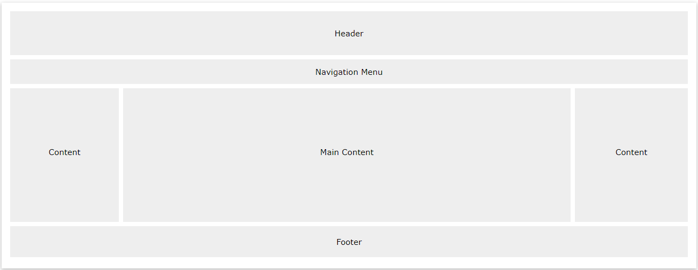

# EasyMall-Front Project Design

### Layout



Navigation Bar

```css
/* The navbar container */
.topnav {
  overflow: hidden;
  background-color: #333;
}

/* Navbar links */
.topnav a {
  float: left;
  display: block;
  color: #f2f2f2;
  text-align: center;
  padding: 14px 16px;
  text-decoration: none;
}

/* Links - change color on hover */
.topnav a:hover {
  background-color: #ddd;
  color: black;
}
```

Content

- 1-column (often used for mobile browsers)
- 2-column (often used for tablets and laptops)
- 3-column (only used for desktops)

equal 3-column

```css
/* Create three equal columns that floats next to each other */
.column {
  float: left;
  width: 33.33%;
}

/* Clear floats after the columns */
.row:after {
  content: "";
  display: table;
  clear: both;
}

/* Responsive layout - makes the three columns stack on top of each other instead of next to each other on smaller screens (600px wide or less) */
@media screen and (max-width: 600px) {
  .column {
    width: 100%;
  }
}
```

Unequal Columns

```css
.column {
  float: left;
}

/* Left and right column */
.column.side {
  width: 25%;
}

/* Middle column */
.column.middle {
  width: 50%;
}

/* Responsive layout - makes the three columns stack on top of each other instead of next to each other */
@media screen and (max-width: 600px) {
  .column.side, .column.middle {
    width: 100%;
  }
}
```


### Project Directory

- /src
  - /api
  - /asserts
    - /icon
    - /style
  - /common
    - Footer.vue
    - Nav.vue
    - Header.vue
  - /components
    - Button.vue
  - /page
    - /cart
    - /checkout
    - /product
    - /home
    - /login
    - /order
    - /search
    - /user
  - /router
    - index.js
  - /util
  - App.vue
  - main.js
- /static
  - /img
  - /js

### Components

- App Header
- App Nav
- App Main
  - Home Selected
  - Search Products
  - Product Details
  - Shopping Cart
  - User Center
- App Footer


### Code Process

- Build Vue project
- Integration
  - Add Vue Router <https://router.vuejs.org/>
  
    - Install
  
        ```
        $ vue init webpack .
        Install vue-router? Yes
        ```
  
    - Import router in Vue. `src/main.js`
  
        ```
        import router from './router'
        new Vue({
          el: '#app',
          router,
          ...
        })
        ```
  
    - Using router in App components. `src/App.vue`
  
        ```
        <template>
          <div id="app">
            <nav>
                <router-link to="/foo">Go to Foo</router-link>
                <router-link to="/bar">Go to Bar</router-link>
            </nav>
            <router-view />
          </div>
        </template>
        ```
  
    - Definite router. `src/router/index.js`
  
      ```
      import Vue from 'vue'
      import Router from 'vue-router'
      import Foo from '@/components/Foo'
      import Bar from '@/components/Bar'
      
      Vue.use(Router)
      
      export default new Router({
        routes: [
      	{
            path: '/foo',
            name: 'Foo',
            component: Foo
          },
      	{
            path: '/bar',
            name: 'Bar',
            component: Bar
          }
        ]
      })
      ```
  
    - Write redirect Vue component. `Foo.vue`, `Bar.vue`
  
      ```
      <template>
      	<div id="foo">
      		Foo
      	</div>
      </template>
      
      <script>
      export default {
        name: 'Foo'
      }
      </script>
      ```
  
      
  
  - Add Axios for API Call <https://vuejs.org/v2/cookbook/using-axios-to-consume-apis.html>
  
    ```shell
    $ yarn add axios
    ```
  
    ```javascript
    <script>
    
    import axios from 'axios'
    
    axios.get(url)
    	.then(response => {
    		console.log("response: " + JSON.stringify(response))
    		this.types = response.data.data;
    })
    </script>
    ```
  
  - Add Vuex
  
    - Install
  
      ```
      $ yarn add vuex
      ```
  
    - Create Vuex Object. `src/store/index.js`
  
      ```
      import Vue from 'vue'
      import Vuex from 'vuex'
      
      Vue.use(Vuex)
      
      export default new Vuex.Store({
        state: {
          posts: [
            { title: 'Post Title 1' },
            { title: 'Post Title 2' },
            { title: 'Post Title 3' },
            { title: 'Post Title 4' },
            { title: 'Post Title 5' }
          ]
        },
        mutations: {},
        actions: {}
      })
      ```
  
    - Import  Vuex in Vue. `src/main.js`
  
      ```
      import store from './store'
      
      new Vue({
          el: '#app',
          store,
          ...
      })
      ```
  
    - Using Vuex in Component. `My.Vue`
  
      ```
      <template>
      	  <div class="home">
      	  	<!-- directly using by $store-->
      	  	<p>{{ $store.state }}</p>
      	  	<!-- using from js -->
      	  	<li
                  v-for="post in posts"
                  :key="post.title"
                  class="post-item"
                >
              <h1>{{ post.title }}</h1>
            </li>
      	  </div>
      </template>
      <script>
      	export default {
      		name: "Home",
              computed: {
                posts () {
                  return this.$store.state.posts
                }
              }
      	}
      </script>
      ```
  
  - Add Vue-CLI Service
  
    ```
    yarn global add @vue/cli-service
    ```
  
    
  
  - Add Mock API 
  
  - Add Unit Test https://vuejs.org/v2/cookbook/unit-testing-vue-components.html
  
    - Install
  
      ```shell
      $ yarn add @vue/test-utils jest
      ```
  
    - Add test file Greeting.spec.js in /tests/unit
  
    - Run unit test with yarn
  
      ```
      $ yarn test:unit
      ```
  
      
- Implement Pages 


### References

[1] [CSS Website Layout - w3c schools](https://www.w3schools.com/css/css_website_layout.asp)

Project

- [use-mock-data-in-vue - GitHub](https://github.com/TahaSh/use-mock-data-in-vue)
- [ecommerce-netlify - GitHub](https://github.com/sdras/ecommerce-netlify)
- [xmall-front - GitHub](https://github.com/Exrick/xmall-front)

